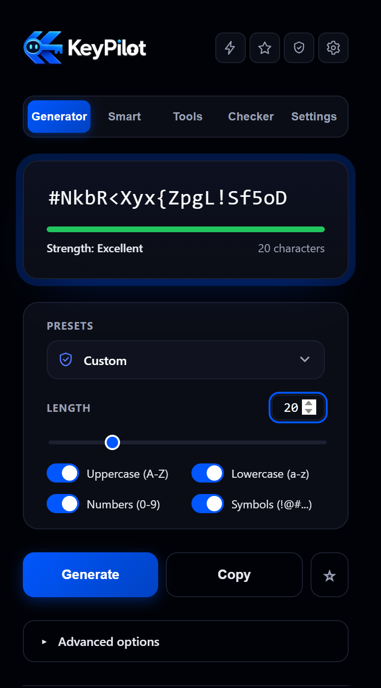
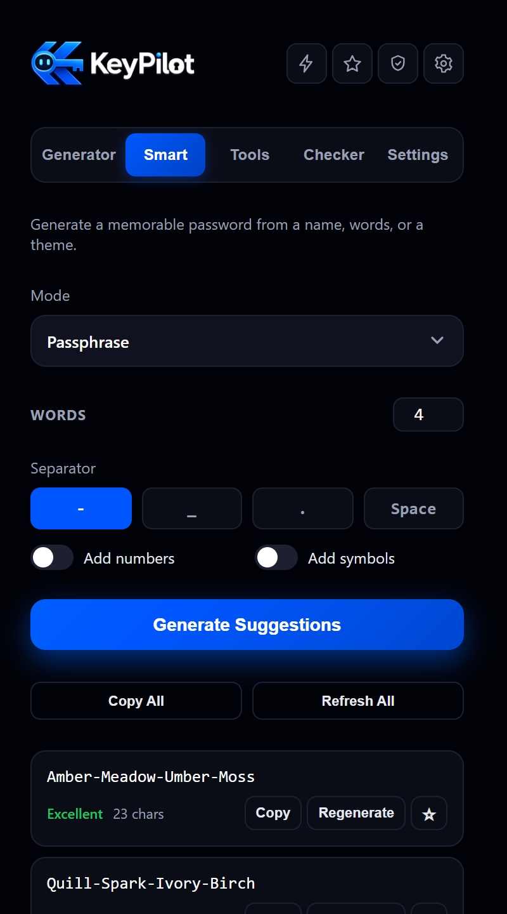
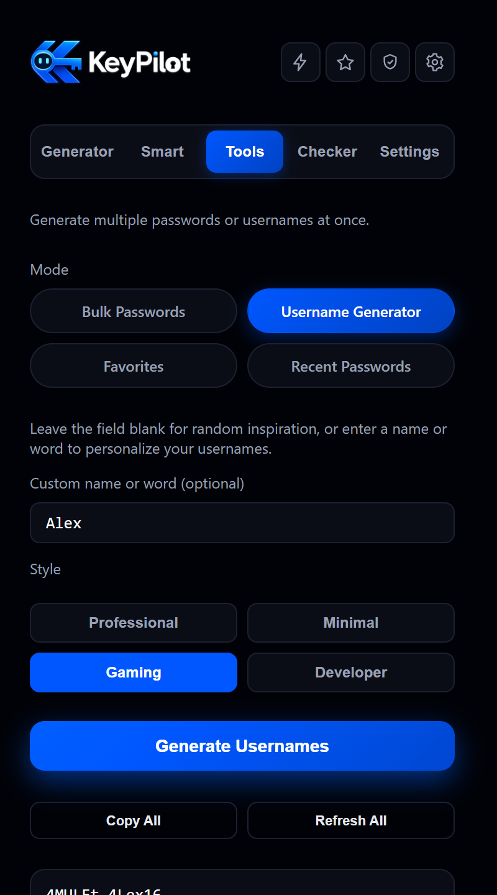
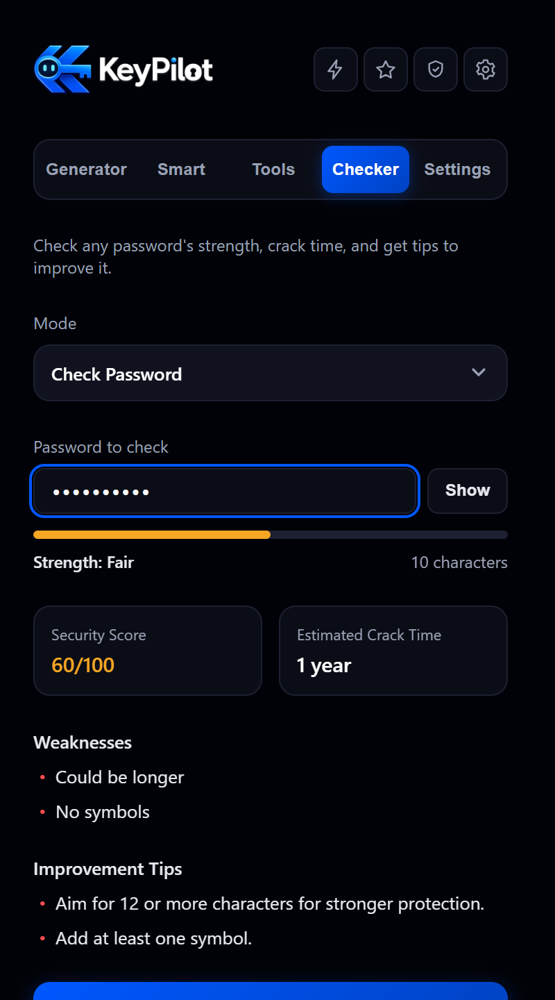
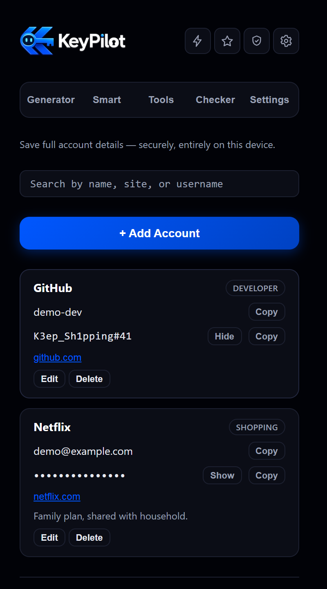

<p align="center">
  
</p>

<h1 align="center">KeyPilot</h1>

<p align="center">
  <b>A premium, 100% offline password security toolkit for Chrome.</b><br />
  Generate, check, organize, and store your credentials — nothing ever leaves your device.
</p>

<p align="center">
  
  
  
  
  
</p>

<p align="center">
  
</p>

---

## Contents

- [What is KeyPilot?](#what-is-keypilot)
- [Screenshots](#screenshots)
- [Features](#features)
- [Privacy & security](#privacy--security)
- [Installation](#installation-load-unpacked)
- [Usage](#usage)
- [Project structure](#project-structure)
- [Running tests](#running-tests)
- [Development history](#development-history)
- [Roadmap](#roadmap)
- [License](#license)

## What is KeyPilot?

KeyPilot is a Manifest V3 Chrome extension for everyday password security:
generate strong passwords and passphrases, check how strong an existing one
is, generate usernames, keep a small local vault of full account details, and
tune every default to how you work — all from a single popup, with **zero
network calls, zero accounts, and zero cloud sync**. Every byte of randomness
comes from the Web Crypto API, and every file that touches storage stays on
your machine.

No build step, no framework, no runtime dependencies — just vanilla
HTML/CSS/JavaScript (ES modules) and Node's built-in test runner for the unit
suite.

## Screenshots

<table>
  <tr>
    <td align="center" width="33%">
      <br />
      <sub><b>Smart Password</b> — Passphrase mode</sub>
    </td>
    <td align="center" width="33%">
      <br />
      <sub><b>Tools</b> — Custom Username Generator</sub>
    </td>
    <td align="center" width="33%">
      <br />
      <sub><b>Checker</b> — strength, score & tips</sub>
    </td>
  </tr>
</table>

<p align="center">
  <br />
  <sub><b>Saved Accounts Vault</b> — full account records, entirely local</sub>
</p>

## Features

### 🔑 Generator
- Crypto-secure generation (`crypto.getRandomValues`, never `Math.random`)
- Length slider + manual input (8–64 characters), independent
  uppercase/lowercase/numbers/symbols toggles
- **Advanced filters**, enforced at generation time: avoid similar-looking
  characters (`O`/`0`/`I`/`l`/`1`), avoid repeated characters (`aaa`),
  avoid sequential runs (`abc`, `123`), and exclude specific characters
- Live strength meter (Weak / Fair / Strong / Excellent)
- **6 security presets** (Banking, Email, Social, Work, Gaming, Developer) —
  one click applies a recommended length, character mix, and filter set
- One-click **Copy**, **☆ Favorite**, and keyboard shortcuts (**G**enerate,
  **C**opy, **F**avorite) while the Generator screen is focused

### 🧠 Smart Password
Six generation styles behind one dropdown: **From Name**, **From Words**,
**Memorable**, **Passphrase** (3–8 words, choice of separator),
**Pronounceable**, and **Theme-Based** (Nature/Space/Ocean/Cyber/Fantasy).
Every mode returns 5 unique, ready-to-use suggestions with Copy, Regenerate,
and Favorite — your input is never saved, only your last-used mode is.

### 🧰 Tools
- **Bulk Passwords** — generate 10 / 25 / 50 / 100 at once from your current
  Generator settings
- **Username Generator** — 4 styles (Professional, Minimal, Gaming,
  Developer); leave the field blank for random inspiration, or type a name to
  get 6 personalized suggestions intelligently built from it
- **Favorites** & **Recent Passwords** — every starred or copied password,
  with a Password Health Score, **Improve** (upgrades anything Weak/Fair),
  Generate Similar, Export TXT/CSV, and Clear

### 🔐 Saved Accounts Vault
A lightweight, local-only credential store, separate from the generator flow:
- Full account records — name/label, website URL, username/email, password,
  category/tag, notes
- **Add · Edit · Search · Delete**, per-account **Show/Hide** password,
  **Copy**, and an **Open** button that launches the saved site
- **Category/tag** is a searchable combobox with predefined categories (Work,
  Personal, Banking, Social, Shopping, Gaming, Developer) — type to filter or
  create a new one on the spot; custom categories are remembered for next time
- Copying from the Vault never touches Recent Passwords — it's a distinct
  feature, not blended into generated-password tracking

### ✅ Checker
**Check Password** mode: strength, character count, a 0–100 security score
(penalized for common/repeated/sequential patterns, not just raw entropy),
estimated crack time, a weaknesses list with matching improvement tips, and a
one-click **Generate Stronger Password**. **Compare Passwords** mode analyzes
two passwords side by side and calls out which one is stronger.

### ⚙️ Settings
Default length and default Smart mode (synced live with the Generator/Smart
screens), a **Remember my preferences** toggle, **Reset All Settings**, and
an About card showing the installed version read live from the manifest.

### 🎨 Interface
- **Header quick actions** — four compact icon buttons (⚡ Quick Generate,
  ★ Favorites, 🛡 Saved Accounts, ⚙ Settings) with native tooltips, reachable
  from any screen
- **Custom dropdown component** used everywhere — a floating, animated panel
  with hover/selected states, a checkmark on the current choice, and full
  keyboard support (arrows, type-ahead, Enter, Escape); no native `<select>`
  remains anywhere in the popup
- Pill-style mode chips, modern thin/dark/rounded scrollbars with a subtle
  blue hover, and a consistent dark, high-contrast design language throughout

## Privacy & security

- **Everything runs entirely locally.** No network calls, no analytics, no
  external services, no account, no login, no cloud sync.
- **Typed input is never saved, tracked, or transmitted.** Anything you type
  into the Checker, Smart Password, or the Tools Username Generator exists
  only in memory for as long as the popup is open.
- **Three deliberate, explicitly-documented exceptions** write plaintext to
  `chrome.storage.local` **on your device only**, and only in response to an
  explicit action:
  - **Favorites** — passwords you tap ☆ on, kept until removed or cleared.
  - **Recent Passwords** — your last 20 *single*-password copies (bulk/"Copy
    All" actions never add to Recent).
  - **Saved Accounts Vault** — every field of an account you explicitly tap
    **Save Account** for, plus any custom category/tag you create. There is
    no separate master password or extra encryption beyond what Chrome's
    storage already provides — this is a convenience, not a hardened
    password manager.
- Everything else (length/character settings, last-used Smart mode) is saved
  only while **Remember my preferences** is on, and **Reset All Settings**
  never touches Favorites/Recent/Vault.
- All randomness comes from the Web Crypto API. The only permission
  requested is `storage`, used exclusively for the data described above.

## Installation (load unpacked)

1. Clone or download this repository.
2. Open `chrome://extensions` in Chrome.
3. Enable **Developer mode** (top-right toggle).
4. Click **Load unpacked** and select the project's root folder.
5. Pin the KeyPilot icon to your toolbar.

## Usage

1. Click the KeyPilot toolbar icon to open the popup.
2. Use the top navigation to switch between **Generator**, **Smart**,
   **Tools**, **Checker**, and **Settings**. The header's icon buttons jump
   straight to **Quick Generate**, **Favorites**, **Saved Accounts**, or
   **Settings** from anywhere.
3. **Generator** — a password is ready immediately. Pick a preset or adjust
   length/character types yourself; open **Advanced options** for the extra
   filters. **G**/**C**/**F** work as keyboard shortcuts.
4. **Smart** — choose a mode, fill in the fields it shows, and hit
   **Generate Suggestions** for 5 secure options.
5. **Tools** — pick a mode chip: Bulk Passwords, Username Generator (random
   or personalized), Favorites, or Recent Passwords.
6. **Checker** — paste a password to analyze it, or switch to **Compare
   Passwords** to test two side by side.
7. **Settings** — set your defaults, toggle preference-saving, or reset
   everything.
8. **Saved Accounts Vault** (header's shield icon) — search, add, edit, or
   delete full account records, with a searchable/creatable category picker.

## Project structure

<details>
<summary>Click to expand the full file tree</summary>

```
KeyPilot-Chrome-Extension/
├── manifest.json                    # Manifest V3 config (icons, storage permission)
├── package.json                     # test script only, no runtime dependencies
├── keypilot-logo.png                # source logo (icon mark + wordmark)
├── icon16.png, icon48.png, icon128.png
├── docs/
│   └── screenshots/                 # README screenshots
├── src/
│   ├── popup/
│   │   ├── popup.html               # popup markup
│   │   ├── popup.css                # popup styling
│   │   └── popup.js                 # wires UI to lib/component modules
│   ├── lib/
│   │   ├── passwordGenerator.js     # pure, crypto-secure, configurable generation
│   │   ├── passwordStrength.js      # pure strength estimation
│   │   ├── passwordChecker.js       # password analysis + stronger-password generation
│   │   ├── presets.js               # 6 security presets
│   │   ├── settingsStorage.js       # chrome.storage.local wrapper (settings, smart mode, remember flag)
│   │   ├── smartPassword.js         # From Name / From Words suggestion generation
│   │   ├── memorablePassword.js     # Memorable mode
│   │   ├── passphrase.js            # Passphrase mode
│   │   ├── pronounceablePassword.js # Pronounceable mode
│   │   ├── themePassword.js         # Theme-Based mode
│   │   ├── bulkGenerator.js         # Bulk password generation (10/25/50/100)
│   │   ├── usernameGenerator.js     # Username generation (4 styles, random + custom word)
│   │   ├── passwordLibrary.js       # Favorites/Recent chrome.storage.local wrapper
│   │   ├── accountVault.js          # Saved Accounts Vault storage (CRUD + search + categories)
│   │   ├── similarPassword.js       # Generate Similar (matches length + character profile)
│   │   ├── comparePasswords.js      # Compare Passwords analysis + winner
│   │   ├── exportPasswords.js       # TXT/CSV formatting + file download
│   │   ├── passwordPatterns.js      # shared repeated/sequential-run detection
│   │   ├── randomUtils.js           # shared crypto-random helpers (bias-free randomInt)
│   │   ├── charsets.js              # shared digit/symbol charsets
│   │   ├── wordLists.js             # shared common + per-theme word lists
│   │   └── clipboard.js             # copy-to-clipboard helper
│   └── components/
│       ├── toast.js                 # reusable toast notification
│       ├── strengthMeter.js         # strength bar + label + count
│       ├── smartResults.js          # suggestion cards (copy + regenerate + favorite)
│       ├── usernameResults.js       # username cards (copy + regenerate)
│       ├── bulkResults.js           # compact scrollable bulk-password list
│       ├── libraryResults.js        # Favorites/Recent list
│       ├── vaultResults.js          # Saved Accounts cards (show/hide, copy, open URL, edit, delete)
│       └── dropdown.js              # shared custom dropdown/combobox (replaces every native <select>)
└── test/                            # one *.test.js per lib module, node:test + node:assert
```

</details>

## Running tests

Pure logic (generation, strength estimation, storage fallback paths) is
covered by unit tests using Node's built-in test runner — no dependencies to
install:

```bash
npm test
```

## Development history

<details>
<summary>KeyPilot was built in phases — click to expand the full changelog</summary>

- **Phase 1.1/1.2** — core generator: crypto-secure generation, length,
  character types, strength meter, settings persistence.
- **Phase 2.1/2.2** — Smart Password: From Name, From Words, then Memorable,
  Passphrase, Pronounceable, and Theme-Based modes, plus the top-level
  Generator/Smart/Checker/Settings navigation.
- **Phase 3** — Checker (strength, score, crack time, weaknesses/tips,
  Generate Stronger Password), security presets, and a full visual redesign
  of the Generator screen.
- **Phase 4.1** — Tools (bulk passwords, username generator) and a
  fully built-out Settings screen.
- **Phase 4.2** — final polish pass: real branding and correctly-sized
  toolbar icons, an accessibility audit (keyboard focus outlines,
  `role="alert"` on warnings), dead-CSS removal, full regression pass.
- **Phase 5.1 — Smart Productivity** — Favorites and Recent Passwords,
  Generate Similar, Compare Passwords, TXT/CSV export, in-popup keyboard
  shortcuts (G/C/F).
- **Phase 5.2 — Smart Security & Final Refinements** — avoid-repeated /
  avoid-sequential generation-time filters, Password Health Score + Improve
  on Favorites/Recent, a modulo-bias fix in the shared `randomInt()`, header
  redesign with the full logo lockup, and the THINXIFY.COM footer.
- **Phase 5.3 — Tools Polish & Custom Usernames** — pill-style mode chips
  replacing the Tools dropdown, Custom Username mode, a smaller header logo.
- **Phase 6 — Account Vault, Header & UI Improvements** — the Saved Accounts
  Vault, four header quick-action icons, a Favorites discoverability fix, and
  modern scrollbars app-wide.
- **Phase 7 — Saved Accounts & Dropdown Redesign** — the searchable/creatable
  Category combobox, and a full rebuild of every dropdown in the app
  (`src/components/dropdown.js`) replacing every native `<select>`/
  `<datalist>` with one premium, animated, keyboard-accessible component.

</details>

## Roadmap

Future phases may add cloud sync, autofill, account login, and true
password-manager functionality (encrypted vaults, master-password
protection, browser autofill integration, etc.). These remain intentionally
out of scope for now — the Saved Accounts Vault and Favorites/Recent are
lightweight local conveniences, storing plaintext in `chrome.storage.local`
with no additional encryption, not a hardened password manager.

## License

No license has been declared for this project yet — all rights reserved by
default. Contact [THINXIFY](https://thinxify.com/) for usage or contribution
inquiries.

---

<p align="center">
  Developed by <a href="https://thinxify.com/"><b>THINXIFY.COM</b></a>
</p>
